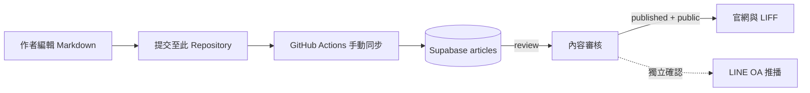

# 謝天地的修道丹心｜文案與素材庫

[](https://daou.veridiangold.com/)
[](https://github.com/bioitrust0414-collab/hsieh_daou_v1)

此 Repository 是「謝天地的修道丹心」的**原始文案與素材來源庫**。它負責保存可編輯、可追溯的講演 Markdown、道家主題文稿與圖像素材；網站、LINE OA 與會員功能則由 [`hsieh_daou_v1`](https://github.com/bioitrust0414-collab/hsieh_daou_v1) 負責。

> **唯一內容來源原則：** 請在此 Repository 修改完整講稿，不要直接在網站 Repository 修改已同步正文。文稿由 Git 版本控制，經手動同步與審核後才會出現在網站；網站公開不會自動推播 LINE OA。

## 內容現況

目前核心內容為《山海經》13 次完整講演，已依南山、西山、北山、東山、中山、海外、海內與大荒等結構整理。其公開呈現可由 [山海經典藏目錄](https://daou.veridiangold.com/shanhaijing) 瀏覽。

| 講次 | 主題 | Markdown 檔案 |
| :--- | :--- | :--- |
| 第01次 | 南山經 | [`第01次_南山經_彙整與討論.md`](./第01次_南山經_彙整與討論.md) |
| 第02次 | 西山經 | [`第02次_西山經_整合詳版.md`](./第02次_西山經_整合詳版.md) |
| 第03次 | 北山經 | [`第03次_北山經_整合詳版.md`](./第03次_北山經_整合詳版.md) |
| 第04次 | 東山經 | [`第04次_東山經_彙整與討論.md`](./第04次_東山經_彙整與討論.md) |
| 第05次 | 中山經（上） | [`第05次_中山經（上）_整合詳版.md`](./第05次_中山經（上）_整合詳版.md) |
| 第06次 | 中山經（下） | [`第06次_中山經（下）_深度彙整.md`](./第06次_中山經（下）_深度彙整.md) |
| 第07次 | 海外經（上） | [`第07次_海外經（上）_彙整與討論.md`](./第07次_海外經（上）_彙整與討論.md) |
| 第08次 | 海外經（下） | [`第08次_海外經（下）_彙整與討論.md`](./第08次_海外經（下）_彙整與討論.md) |
| 第09次 | 海內經（上） | [`第09次_海內經（上）_彙整與討論.md`](./第09次_海內經（上）_彙整與討論.md) |
| 第10次 | 海內經（下） | [`第10次_海內經（下）_彙整與討論.md`](./第10次_海內經（下）_彙整與討論.md) |
| 第11次 | 大荒經（上） | [`第11次_大荒經（上）_彙整與討論.md`](./第11次_大荒經（上）_彙整與討論.md) |
| 第12次 | 大荒經（下） | [`第12次_大荒經（下）_彙整與討論.md`](./第12次_大荒經（下）_彙整與討論.md) |
| 第13次 | 海內經（末卷） | [`第13次_海內經（末卷）_全書總結.md`](./第13次_海內經（末卷）_全書總結.md) |

Repository 亦保存內丹與道家主題的 Word 原稿及山海經圖解素材。這些檔案可作為後續整理與策展的來源，但目前的自動同步流程僅接受具有 Front Matter 的 Markdown 講稿。

## 文案發布架構



| 階段 | 狀態 | 是否對外可見 | 是否 LINE 推播 |
| :--- | :--- | :---: | :---: |
| 文案撰寫／校對 | Git Commit | 否 | 否 |
| 同步至 Supabase | `review` | 否 | 否 |
| 網站公開 | `published` + `public` | 是 | 否 |
| LINE 推播 | `line_push_status = sent` | 是 | 是，需另行確認 |

## Markdown Front Matter 規格

每一篇可同步講稿都必須以 `---` 包住的 Front Matter 開頭。同步程式使用其中的固定 ID、章節、slug 與版本欄位建立可追溯的 Supabase 文章；請勿任意變更已發布文章的 `id` 或 `slug`。

```yaml
---
id: "shanhaijing-nanshan-lecture-01" # 固定、全域唯一的來源 ID
collection: shanhaijing
collection_name: "山海經"
chapter: nanshan                         # 見下方可用章節值
after: null                              # 可選：續篇可指向前一篇來源 ID
chapter_name: "南山經"
episode: "第01次"
sort_order: 1
slug: nanshan-geography-beasts-herbs     # 網站公開網址的固定識別碼
content_type: full_lecture
status: draft                             # 文案庫編輯狀態；不直接決定網站公開
visibility: public                        # public 或 members
published_at: null
title: "南山經：地理、異獸與草木的文化密碼"
subtitle: "從招搖之山到南方山系，重構先民對自然、徵兆與生存的理解"
summary: "供網站卡片與搜尋使用的短摘要。"
tags: ["山海經", "南山經", "異獸", "草木"]
cover_image: null
line_push: false                          # 僅為推播草稿意圖，不會自動傳送
line_push_copy: "供 LINE OA 審核的訊息草稿。"
source_version: 1                         # 正文重大修訂時遞增
---

# 講演標題

文章正文從此開始。
```

目前同步器支援的 `chapter` 值如下：

| `chapter` | Supabase 章節鍵 | 官網區塊 |
| :--- | :--- | :--- |
| `nanshan` | `nan` | 南山經 |
| `xishan` | `xi` | 西山經 |
| `beishan` | `bei` | 北山經 |
| `dongshan` | `dong` | 東山經 |
| `zhongshan` | `zhong` | 中山經 |
| `haiwai` | `haiwai` | 海外經 |
| `hainei`、`hainei-final` | `hainei` | 海內經 |
| `dahuang` | `dahuang` | 大荒經 |

正文使用 `#` 作為文件標題，使用 `##` 切分網站文章段落。同步器會將每個 `##` 標題與其內容解析為網站的可讀章節；表格、引文與 Markdown 標記將被保留。

## 編輯與同步流程

完整操作請參閱 [`docs/MANUAL_CONTENT_SYNC.md`](./docs/MANUAL_CONTENT_SYNC.md)。日常工作建議採取下列流程：

1. 在此 Repository 建立或編輯 Markdown，確認 Front Matter、標題與 `##` 段落結構完整。
2. 提交至 GitHub `main` 分支，讓內容版本可追溯。
3. 前往 **Actions → 手動同步講稿至 Supabase → Run workflow**。
4. 首先維持 `dry_run = true`，確認檔案路徑與解析資訊正確。
5. 確認後，以 `dry_run = false` 重新執行。文章只會寫入 Supabase `review`，不會公開網站或推播 LINE OA。
6. 在審核流程中確認內容後，才將文章設為 `published`、`public`；LINE OA 推播則另行建立與確認。

GitHub Actions 使用 Repository Secrets `SUPABASE_URL` 與 `SUPABASE_SECRET_KEY`。請僅在 GitHub Secrets 設定，**不可**將任何密鑰寫入 Markdown、Commit、Issue、README 或程式碼。

## Repository 結構

```text
hsieh_dauo_repo/
├── .github/
│   ├── scripts/
│   │   └── sync-markdown-to-supabase.mjs   # 單篇 Markdown 同步器
│   └── workflows/
│       └── manual-content-sync.yml         # 手動同步 GitHub Actions
├── docs/
│   └── MANUAL_CONTENT_SYNC.md              # 同步與審核操作指南
├── 第01次_南山經_彙整與討論.md             # 已規格化山海經講稿
├── ...
├── 第13次_海內經（末卷）_全書總結.md
├── 山海經南山經地理神話圖解.png
└── 道家與內丹主題原始文件.docx
```

## 與網站 Repository 的邊界

| Repository | 唯一責任 | 不應承擔的工作 |
| :--- | :--- | :--- |
| `hsieh_dauo_repo` | 文案、素材、Front Matter 與內容版本 | 網頁版型、Supabase schema、LINE API 程式 |
| `hsieh_daou_v1` | 網站 UI、文章讀取、LIFF、LINE Webhook、資料庫遷移 | 直接手動維護已同步講稿正文 |

透過這個分工，作者可以安全維護文案，而網站與推播系統可持續演進，不會互相覆蓋或造成發布混亂。

## 相關連結

| 項目 | 連結 |
| :--- | :--- |
| 正式網站 | [daou.veridiangold.com](https://daou.veridiangold.com/) |
| 山海經典藏 | [山海經講演筆記](https://daou.veridiangold.com/shanhaijing) |
| 網站 Repository | [hsieh_daou_v1](https://github.com/bioitrust0414-collab/hsieh_daou_v1) |
| 手動同步指南 | [MANUAL_CONTENT_SYNC.md](./docs/MANUAL_CONTENT_SYNC.md) |

## 授權

© 2026 謝天地的修道丹心。除非另有書面授權，講演文稿、圖像與相關素材均保留所有權利。
